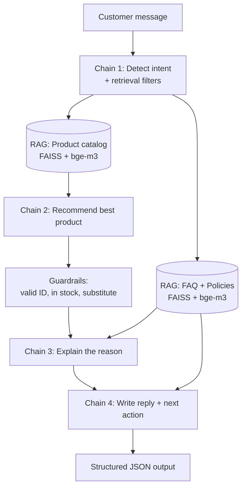

# 🛒 بياع AI (Bayya3 AI): AI Sales Assistant

An AI assistant for the sales team of an Egyptian grocery store. A sales rep pastes a **customer message** (Egyptian Arabic, MSA or English) and gets back:

| Output | Meaning |
|---|---|
| **Customer intent** | What the customer wants (product search, price, complaint, policy question...) |
| **Recommended product** | The best in-stock product from the catalog |
| **Reason** | Why that product (or why none) |
| **Suggested reply** | A ready-to-send answer in the customer's language and dialect |
| **Next action** | What the sales team should do next (send reply, confirm order, escalate...) |

> بياع AI مساعد مبيعات ذكي: بتكتب رسالة العميل، وهو بيحدد نيته، يرشّح المنتج المناسب، ويجهّزلك الرد.

---

## How it works

**RAG + Chains + Output Parser**



1. **Chain 1 (intent):** returns a `CustomerIntent` object: intent label, language, sentiment, whether a product is needed, a search phrase, and optional filters (budget, category, tags).
2. **RAG:** semantic search over the product catalog and over FAQ/policy chunks (`BAAI/bge-m3` embeddings + FAISS).
3. **Chain 2 (recommend):** picks one product ID from the retrieved candidates (`ProductChoice`).
4. **Chain 3 (reason):** a short explanation grounded only in catalog/policy facts (`ReasonOut`).
5. **Chain 4 (reply):** the customer-facing message plus the next action (`ReplyOut`).

Every chain uses a **Pydantic output parser** (`PydanticOutputParser`), so each step returns a validated object and not free text.

### Built-in safeguards

- **Filter sanitising:** categories and tags proposed by the LLM are checked against the real catalog values, so an invented tag can't empty the results.
- **Progressive relaxation:** if strict filters return nothing, they are relaxed step by step (tags, then category, then price).
- **Substitutes:** an out-of-stock hit automatically brings its alternative product (e.g. out-of-stock lactose-free milk leads to soy milk).
- **Product-ID guardrail:** an invented or out-of-stock ID from the model is replaced by the substitute or the best in-stock candidate.
- **JSON retries:** if the model's JSON fails to parse, the chain retries with light sampling (greedy decoding would repeat the same mistake).
- **Grounded prompts:** the reason and reply prompts allow only facts from the catalog and policy context (no invented prices, discounts or delivery times).

---

## Tech stack

| Layer | Tools |
|---|---|
| LLM | `mistralai/Mistral-Nemo-Instruct-2407`, 4-bit NF4 (bitsandbytes), via 🤗 Transformers |
| Embeddings / search | `BAAI/bge-m3` (sentence-transformers) + FAISS (`IndexFlatIP`) |
| Chains / parsing | LangChain (`PromptTemplate`, `LLMChain`) + Pydantic output parsers |
| Backend | FastAPI + Uvicorn, exposed through an ngrok tunnel |
| Frontend | Streamlit (Arabic, RTL, storefront-style UI) |
| Runtime | Kaggle notebook with 2 GPUs (LLM on GPU 0, embeddings on GPU 1) |

---

## Repository structure

```
.
├── app.py                     # Streamlit frontend
├── requirements.txt           # frontend dependencies
├── README.md
├── .gitignore
|── .streamlit/
    ├── config.toml            # light theme (committed)
    └── secrets.toml           # API_URL + API_KEY (NOT committed)
|── data/
    ├── catalog.csv
    ├── faq.pdf
    ├── faq.txt
    ├── policies.pdf          
    └── policies.txt  
└── notebook/
    └── bayyaaai-project.ipynb     # RAG + chains + FastAPI backend (runs on Kaggle)
```

---

## Data

The knowledge base lives in a Kaggle dataset (`bayyaaai-data`) with:

| File | Content |
|---|---|
| `catalog.csv` | 77 products: Arabic/English names, brand, category, size, description, tags, `price_egp`, `price_per_kg_or_l`, `in_stock`, `alternative_id` |
| `faq.txt` | 30 Q&A pairs (`س: ... ج: ...`), one chunk per pair |
| `policies.txt` | Company policies in `##` sections, 34 chunks (each paragraph keeps its section title) |
| `faq.pdf`, `policies.pdf` | PDF versions of the same documents |

Update `DATA_DIR` in the notebook if your dataset path is different.

---

## Setup

### 1. Backend (Kaggle notebook)

1. Create a Kaggle notebook with a **GPU (2× T4)** accelerator, and attach the `bayyaaai-data` dataset.
2. Add two **Kaggle Secrets** (*Add-ons → Secrets*):
   - `NGROK_TOKEN`: your ngrok auth token
   - `API_KEY`: a long random string, e.g. `python -c "import secrets; print(secrets.token_urlsafe(32))"`
3. Make sure the notebook has Hugging Face access to `Mistral-Nemo-Instruct-2407` if the model requires accepting a license.
4. Run the notebook cells top to bottom. The last cell prints:
   ```
   Your public URL: https://xxxx-xx-xx.ngrok-free.app
   ```
5. **Keep the notebook running.** The API stops when the Kaggle session ends, and the free ngrok URL changes every time the tunnel restarts.

### 2. Frontend (Streamlit)

```bash
pip install -r requirements.txt
```

Create `.streamlit/secrets.toml`:

```toml
API_URL = "https://xxxx-xx-xx.ngrok-free.app"
API_KEY = "the-same-key-you-put-in-kaggle-secrets"
```

Run it:

```bash
streamlit run app.py
```

### 3. Deploy the frontend (Streamlit Community Cloud)

1. Push the repo to GitHub (`secrets.toml` is ignored by `.gitignore`).
2. On [share.streamlit.io](https://share.streamlit.io), create a new app from the repo and select `app.py`.
3. Under **Advanced settings → Secrets**, paste the same two lines as in `secrets.toml`.
4. When the ngrok URL changes, edit `API_URL` under **Settings → Secrets** and reboot the app. No code change is needed.

---

## API reference

Base URL: the ngrok public URL.

### `POST /answer`

| | |
|---|---|
| **Header** | `Authorization: Bearer <API_KEY>` |
| **Body** (form) | `prompt`: the customer message |

```bash
curl -X POST "$API_URL/answer" \
  -H "Authorization: Bearer $API_KEY" \
  -d "prompt=عايز لبن بدون لاكتوز"
```

Example response (text fields are illustrative, generated by the LLM):

```json
{
  "response": "<same as suggested_reply>",
  "mode": "sales_assistant",
  "customer_intent": "product_search",
  "recommended_product": {
    "product_id": "P004",
    "name": "لبن صويا بدون سكر",
    "price_egp": 85.0,
    "in_stock": true
  },
  "reason": "...",
  "suggested_reply": "...",
  "next_action": "offer_substitute"
}
```

**Possible values**

- `customer_intent`: `product_search`, `price_inquiry`, `availability_check`, `comparison`, `policy_or_faq`, `order_issue`, `ready_to_buy`, `other`
- `next_action`: `send_reply`, `ask_clarifying_question`, `offer_substitute`, `confirm_order`, `escalate_to_human`, `follow_up_later`
- `recommended_product`: an object, or `null` when no product applies (e.g. policy question)

**Errors**

| Status | Meaning |
|---|---|
| `401` | Missing or wrong API key |
| `422` | Empty prompt |
| `502` | The model returned invalid output even after retries. Try again |

### `GET /health`

Returns `{"status": "ok"}`.

> Requests are processed **one at a time** (a lock protects the single GPU model), and one request runs four LLM calls, so expect roughly 10–40 seconds per response.

---

## Troubleshooting

| Problem | Likely cause / fix |
|---|---|
| `404` from the frontend | Stale or wrong ngrok URL, tunnel not running, or the server was started without `/answer`. Open `<url>/docs` in a browser to check. Re-run the ngrok cell and update `API_URL` |
| `401 Unauthorized` | `API_KEY` in the frontend doesn't match the Kaggle secret |
| `502` / invalid output | The model broke the JSON format. Retry, or test `intent_chain.run({"message": "..."})` in the notebook to see the raw output |
| Request times out | Normal on a cold start. The frontend waits up to 300 s |
| White / unreadable text in the UI | Make sure `.streamlit/config.toml` (`base = "light"`) is committed, then reboot the app |
| `Cannot connect` | Kaggle session ended. Restart the notebook and update `API_URL` |

---

## Security notes

- **Never commit** `.streamlit/secrets.toml` or any token. If a key was ever committed, treat it as leaked and rotate it. Deleting it from a later commit does not remove it from git history.
- The backend is reachable by anyone who knows the ngrok URL, so the API key is its only protection. Use a long random value.
- The free ngrok plan has no uptime guarantee, so this setup is meant for demos and prototypes. For production, host the backend on a dedicated GPU server.

---

## Limitations and ideas

- Quality depends on a 4-bit 12B model, so occasional malformed JSON or weak Egyptian-dialect phrasing can happen. The retries and guardrails reduce this but don't remove it.
- Requests are sequential and not suited to high traffic.
- Possible improvements: merge chains 2 and 3 to cut latency, add conversation memory, add order placement, stream responses, add evaluation tests for intents and recommendations.

---

## License

Add your license here (e.g. MIT).
